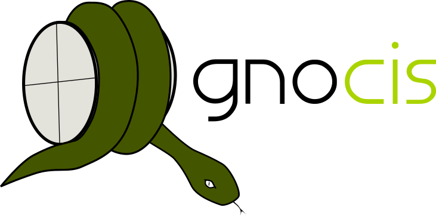

# Gnocis
Bjørn Bredesen, 2018-2019

----------------------------------------------------------------------

## About

Gnocis is a system in Python 3 for the analysis and the modelling of *cis*-regulatory element DNA sequences. A broad suite of tools is implemented for data preparation, feature set definition, model training and prediction.

----------------------------------------------------------------------

## Installing

To install via the PyPI package manager, open a terminal and execute

`pip install gnocis`

To build, run

`make all`

To install, run

`pip install .`

-------------------------------------------------

## Using

See the `tutorial/` folder for an in-depth tutorial in using Gnocis.

The manual is available at: https://bjornbredesen.github.io/gnocis/

----------------------------------------------------------------------

## Features

 * DNA sequence handling
     * File format support - Loading and streaming
        - FASTA
        - 2bit
     * File format support - Saving
        - FASTA
     * Operations
        - Printing
        - Sliding window extraction
        - Reverse complement generation
 * Sequence region handling
     * File format support - Loading and saving
        - GFF
        - BED
        - Coordinate lists (`chromosome:start..end`)
     * Operations
        - Overlap acquisition
        - Non-overlap acquisition
        - Merged set generation
        - Exclusion set generation
        - Sequence region extraction
 * Modelling
     * Generative DNA sequence models, with training and sequence generation
        - I.i.d.
        - N'th order Markov chains
     * Confusion matrices
        - Generation from model statistics
        - Printing
        - Receiver Operating Characteristic curve generation
        - Precision Recall Curve generation
        - Area Under the Curve calculation
     * Feature models
        - Log-odds
        - Dummy
        - Support Vector Machines (via sklearn)
        - Random Forest (via sklearn)
     * Features
        - *k*-mer spectrum
        - Motif occurrence spectrum
        - Motif pair occurrence spectrum
 * Motifs
     * Types
        - IUPAC nucleotide motifs
        - Position Weight Matrices
        - *k*-mer spectra
 * Easy to use
 * Objects are represented by classes, with human-readable descriptions
 * Optimized with Cython
 * ...

## Requirements

 * Python 3.5
 * Cython
 * sklearn (for SVM and RF modelling)

-------------------------------------------------

## Citing
If you use Gnocis in published research, Gnocis must be cited. An article for Gnocis is in the process of being submitted for peer review. Please check back for an updated citation policy.

----------------------------------------------------------------------

## License

MIT License

Copyright (c) 2019 Bjørn Bredesen

Permission is hereby granted, free of charge, to any person obtaining a copy
of this software and associated documentation files (the "Software"), to deal
in the Software without restriction, including without limitation the rights
to use, copy, modify, merge, publish, distribute, sublicense, and/or sell
copies of the Software, and to permit persons to whom the Software is
furnished to do so, subject to the following conditions:

The above copyright notice and this permission notice shall be included in all
copies or substantial portions of the Software.

THE SOFTWARE IS PROVIDED "AS IS", WITHOUT WARRANTY OF ANY KIND, EXPRESS OR
IMPLIED, INCLUDING BUT NOT LIMITED TO THE WARRANTIES OF MERCHANTABILITY,
FITNESS FOR A PARTICULAR PURPOSE AND NONINFRINGEMENT. IN NO EVENT SHALL THE
AUTHORS OR COPYRIGHT HOLDERS BE LIABLE FOR ANY CLAIM, DAMAGES OR OTHER
LIABILITY, WHETHER IN AN ACTION OF CONTRACT, TORT OR OTHERWISE, ARISING FROM,
OUT OF OR IN CONNECTION WITH THE SOFTWARE OR THE USE OR OTHER DEALINGS IN THE
SOFTWARE.

----------------------------------------------------------------------

## Logo

Logo: Copyright Bjørn Bredesen

Font: Emporium. Credit: emnazar. https://www.dafont.com/emporium-2.font

